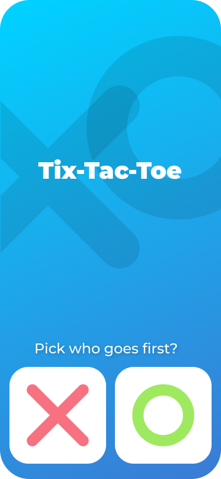
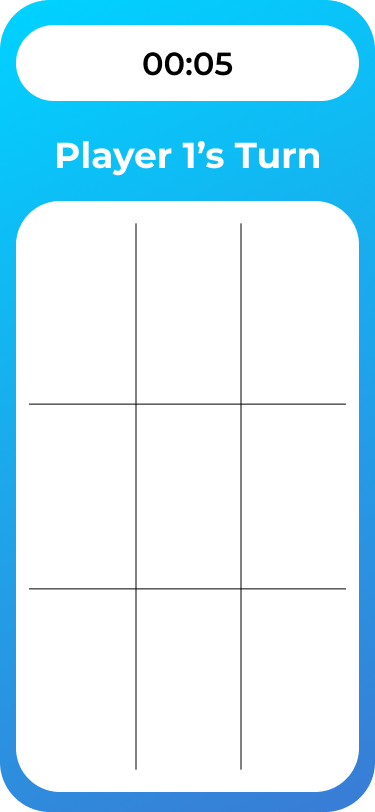
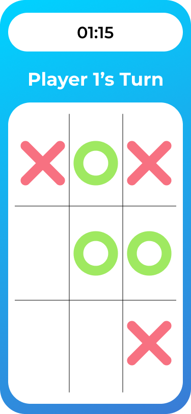

Tic-Tac-Toe Game

A simple and interactive Tic Tac Toe (XO) game built using Flutter and Dart.

About the Project

This project is a two-player XO game where players take turns placing X and O on a 3×3 board.

The game automatically detects the winner or a draw and allows players to restart the game and play again.

Features

- Two-player gameplay
- X and O turns
- Automatic winner detection
- Draw detection
- Restart / Play Again
- Simple and clean user interface

Technologies

- Flutter
- Dart
## Screenshots

  
  
  

Getting Started

##Prerequisites

Make sure you have Flutter installed on your machine.

##Installation

1. Clone the repository:

git clone https://github.com/MalakSaleh1/tic-tac-toe.git

2. Navigate to the project folder:

cd xo-game-flutter

3. Install dependencies:

flutter pub get

4. Run the application:

flutter run

Purpose

This project was created as a Flutter practice project to improve my understanding of:

- Flutter UI development
- Dart programming
- Stateful widgets
- User interaction
- Game logic
- Managing application state

Author

Malak Saleh
